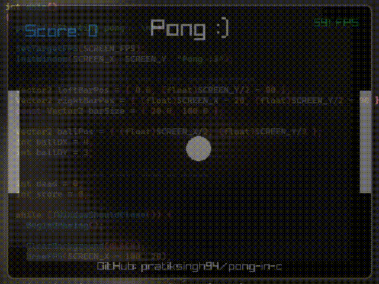

# Pong, in C 
thats it, i was bored so made it.

### Libraries used:
- [raylib](https://github.com/raysan5/raylib)

### How to play (on linux):
1. [install raylib according to wiki](https://github.com/raysan5/raylib/wiki/Working-on-GNU-Linux)
2. git clone the repository
3. run `make` in root of repo
4. run `./build/main`
5. enjoy

### Controls:
W and S => Left bar up and down
Arrow up and Arrow down => right bar up and down

bye <3
